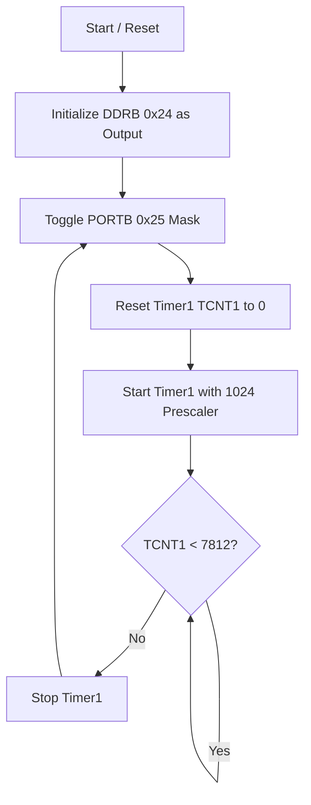
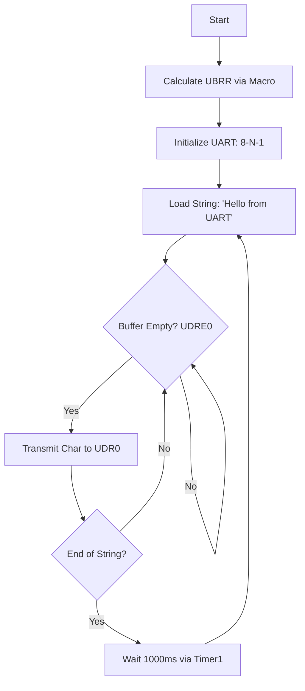

 # ATmega328P Bare-Metal Firmware Development

This repository contains low-level firmware implementations for the ATmega328P (Arduino Uno), developed as part of a technical evaluation and assignment. The objective was to demonstrate proficiency in advanced RISC architecture and direct hardware register manipulation, bypassing high-level abstraction libraries like the Arduino IDE. 

 

## GPIO Driver

The primary objective of this module was to develop a bare-metal GPIO driver to toggle an LED at a precise 500ms interval using hardware timers rather than software delays.

### Program Logic Flow

The following logic ensures that the **Advanced RISC architecture** processes the LED toggle with minimal instruction overhead:

### Development Evolution

The firmware reached its final optimized state through three distinct stages of refinement, moving from high-level abstraction to low-level hardware control.

**Stage 1:** High-Level Abstraction (Arduino Framework)

Initially, the project was prototyped using the standard void setup() and void loop() structure with digitalWrite() and delay(). While functional, this introduced significant "bloat" and overhead from the Arduino core libraries, hiding the underlying hardware logic.

**Stage 2:** Transition to C Entry Point (int main)

To bypass the hidden initialization routines of the Arduino IDE, the code was rewritten using the standard C entry point: int main(void).

Removed setup/loop in favor of a while(1) infinite loop.

Started using direct Port manipulation (e.g., PORTB |= (1 << 5)) to improve execution speed.

**Stage 3:** Hardware Timer Implementation (Final Version)

The final refinement replaced software-based delays (which waste CPU cycles) with Hardware Timer1.

The Shift: Moved from "busy-waiting" with software loops to polling a 16-bit hardware counter.

The Benefit: This approach ensures the blink frequency remains consistent regardless of how many other instructions are added to the main loop, as the timing is handled by the silicon's clock-division logic rather than instruction execution time.

### Technical Implementation

The development process involved mapping the physical hardware to the memory-mapped I/O space and configuring internal peripherals for timing accuracy.

#### 1. Register Mapping & I/O Control

By bypassing the Arduino abstraction layer, I interacted directly with the 8-bit bi-directional I/O ports.

1. **Port Selection:** Referenced the Pinout to identify PB5 (Digital Pin 13) as the target output.

2. **Address Discovery:** Referenced Section 30. Register Summary to locate the specific memory addresses.

3. **DDRB (0x24):** Data Direction Register used to configure the pin as an output.

4. **PORTB (0x25):** Data Register used to toggle the pin state.

#### 2. Precise Hardware Timing

To achieve a reliable 500ms blink rate, I utilized the 16-bit Timer/Counter 1 instead of inaccurate software loops.

1. **Configuration:** Referenced the Register Summary (Timer) to find the Control and Counter registers (TCCR1B, TCNT1).

2. **Prescaler Logic:** Configured a 1024 prescaler to divide the 16MHz clock.

3. **Calculation:**

To achieve a precise **500ms** blink interval, the **16-bit Timer1** comparison value was derived using the system clock frequency and the prescaler bit settings from:

$$\text{Ticks} = \frac{16,000,000 \text{ (CPU Clock)}}{1024 \text{ (Prescaler)}} \times 0.5 \text{ s} = 7812.5$$

By setting the counter to **7812**, the firmware ensures a highly accurate toggle rate that is independent of software execution overhead.

#### 3. Optimization & Architecture

The implementation leverages the Advanced RISC Architecture , where 131 instructions are mostly executed in a single clock cycle.

1. **Bit-Masking:** Used an OUTPUT_MASK to perform single-cycle bit-functions.

2. **Throughput:** Maximized the 16MIPS throughput by reducing instruction overhead within the main execution loop.

### Hardware Verification & Output

To verify the bare-metal driver's accuracy, the firmware was flashed onto an ATmega328P. The output confirms that the hardware timer logic effectively maintains the requested 500ms duty cycle.

1. **On-board Verification:** The implementation targets the built-in LED connected to **PB5 (Digital Pin 13)**. This provides immediate visual confirmation of the register configuration for Port B.

  

   

2. **External Circuitry:** An external LED was connected in series with a **220Ω current-limiting resistor** to Pin 12. This setup demonstrates that by changing the Output_mask we can toggle different pins in port B on and off.

  

 

## UART Driver

The objective of this module was to implement a bare-metal asynchronous serial transmitter to provide periodic telemetry data. This allows the microcontroller to communicate via a serial data transfer interface at a fixed interval of 1000ms.

### Program Logic Flow

The UART driver follows a "Ready-to-Send" polling architecture to ensure data integrity during transmission:

### Development Evolution & Migration to .c

The project reached its final state through iterative hardware optimization:

- **Iteration 1 (Hardcoded):** Initially used a "magic number" (103) for the baud rate. While functional for a 16MHz clock, it lacked flexibility for different oscillator frequencies.

- **Iteration 2 (Macro-Based Optimization):** Refined the implementation using a pre-processor macro based on the datasheet formula:
  
  
 $$UBRR = \frac{f_{osc}}{16 \times \text{BAUD}} - 1$$ 

  This allows the compiler to calculate the register value at build-time, ensuring zero runtime CPU overhead.

- **Transition to .c:** While the GPIO module used an .ino extension, the UART driver was developed as a pure .c file. This eliminates Arduino IDE pre-processing and hidden library inclusions, providing total control over the hardware compilation unit.

### Technical Implementation
1. **Communication Protocol (8-N-1)**

The USART peripheral was configured to a standard frame format to ensure compatibility with serial data interfaces:

- **Baud Rate:** 9600 bps.

- **Data Bits:** 8 bits.

- **Parity:** None (Disabled).

- **Stop Bit:** 1 bit.

2. **Detailed Function Breakdown**

A. **uart_init(unsigned int ubrr) — Hardware Configuration This function initializes the USART hardware for transmission:**

- **Register Mapping:** The 12-bit Baud Rate value is split across UBRR0H (High byte) and UBRR0L (Low byte).

- **Transmitter Activation:** Setting the TXEN0 bit in UCSR0B enables the transmission circuitry and takes control of the physical TX pin.

- **Protocol Setup:** Configures UCSR0C for 8-bit character size.

B. **uart_transmit(unsigned char data) — Hardware Handshake A blocking function that manages the timing between the CPU and the serial hardware:** 

- **Polling the Flag:** Monitors the UDRE0 (USART Data Register Empty) bit in UCSR0A.

- **Logic:** If UDRE0 is 0, the hardware is still busy. The function blocks until the buffer is clear.

- **Handoff:** Writes the character to the UDR0 register for physical transmission.

C. **uart_print(const char str) — String Streamer Acts as the interface for human-readable data:**

- **Sequential Flow:** Iterates through the string pointer, passing characters to uart_transmit until the null terminator (\0) is reached.

D. **delay_1000ms() — Precise Temporal Control Leverages the 16-bit Timer1 for exact 1-second intervals:**

- **Prescaling:** Sets a 1024 divider to the system clock.

- **Comparison:** Polls TCNT1 until it reaches 15,625, signaling that exactly one second has elapsed on the silicon.

### Hardware Verification & Output

The implementation successfully initiates serial communication and transmits status updates at a fixed frequency. When the serial interface is opened at 9600 Baud, the following output is observed every 1000ms:

  

## Tools & Acknowledgments

1. **Hardware:** ATmega328P (Arduino Uno Rev3).

2. **Simulator:** Wokwi.com

    

3. **Documentation:** Atmel ATmega328P Automotive Datasheet.

4. **Development Assistant:** This project was developed with the assistance of Gemini (Google AI) to refine documentation, optimize Git workflows, and verify register-level math against the datasheet. 
