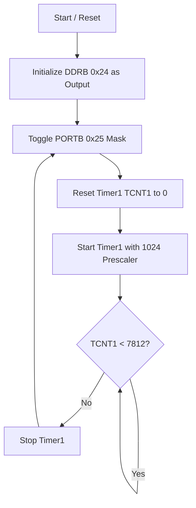
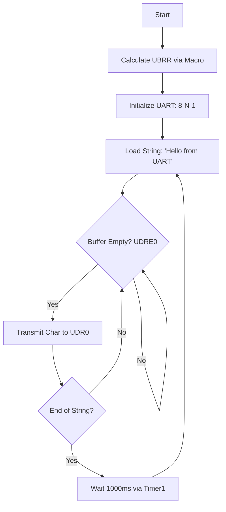

# ATmega328P Bare-Metal Firmware Development

This repository contains low-level firmware implementations for the ATmega328P (Arduino Uno), developed as part of a technical evaluation and assignment. The objective was to demonstrate proficiency in advanced RISC architecture and direct hardware register manipulation, bypassing high-level abstraction libraries like the Arduino IDE. 
 

## GPIO Driver

The primary objective of this module was to develop a bare-metal GPIO driver to toggle an LED at a precise 500ms interval using hardware timers rather than software delays.

### Program Logic Flow
The following logic ensures that the **Advanced RISC architecture** processes the LED toggle with minimal instruction overhead:

### Technical Implementation & Thought Process

The development process involved mapping the physical hardware to the memory-mapped I/O space and configuring internal peripherals for timing accuracy.

#### 1. Register Mapping & I/O Control

By bypassing the Arduino abstraction layer, I interacted directly with the 8-bit bi-directional I/O ports.

1. **Port Selection:** Referenced the Pinout to identify PB5 (Digital Pin 13) as the target output.

2. **Address Discovery:** Referenced Section 30. Register Summary to locate the specific memory addresses:

3. **DDRB (0x24):** Data Direction Register used to configure the pin as an output.

4. **PORTB (0x25):** Data Register used to toggle the pin state.

#### 2. Precise Hardware Timing

To achieve a reliable 500ms blink rate, I utilized the 16-bit Timer/Counter 1 instead of inaccurate software loops.

1. **Configuration:** Referenced the Register Summary (Timer) to find the Control and Counter registers (TCCR1B, TCNT1).

2. **Prescaler Logic:** Configured a 1024 prescaler to divide the 16MHz clock.

3. **Calculation:**
To achieve a precise **500ms** blink interval, the **16-bit Timer1** comparison value was derived using the system clock frequency and the prescaler bit settings from:

$$\text{Ticks} = \frac{16,000,000 \text{ (CPU Clock)}}{1024 \text{ (Prescaler)}} \times 0.5 \text{ s} = 7812.5$$

By setting the counter to **7812**, the firmware ensures a highly accurate toggle rate that is independent of software execution overhead.

#### 3. Optimization & Architecture

The implementation leverages the Advanced RISC Architecture , where 131 instructions are mostly executed in a single clock cycle.

1. **Bit-Masking:** Used an OUTPUT_MASK to perform single-cycle bit-functions.

2. **Throughput:** Maximized the 16MIPS throughput by reducing instruction overhead within the main execution loop.

### Hardware Verification & Output

To verify the bare-metal driver's accuracy, the firmware was flashed onto an ATmega328P. The output confirms that the hardware timer logic effectively maintains the requested 500ms duty cycle.

1. **On-board Verification:** The implementation targets the built-in LED connected to **PB5 (Digital Pin 13)**. This provides immediate visual confirmation of the register configuration for Port B.

  

   
2. **External Circuitry:** An external LED was connected in series with a **220Ω current-limiting resistor** to Pin 12. This setup demonstrates that by changing the Output_mask we can toggle different pins in port B on and off.

  

 

## UART Driver

The objective of this module was to implement a bare-metal asynchronous serial transmitter to provide telemetry data from the ATmega328P. This allows the microcontroller to communicate with via UART using only direct register manipulation.

### Program Logic Flow

The UART driver follows a "Ready-to-Send" polling architecture to ensure no data loss during transmission:

### Development Evolution & Migration to .c

While the GPIO driver was developed as an .ino sketch, the UART driver represents a complete migration to a standard .c file structure.

**Why the shift?** Transitioning to .c removes the final layer of Arduino IDE pre-processing (like automatic function prototyping and hidden Arduino.h inclusions). It forces explicit control over the compilation unit, aligning with industry standards for embedded systems.

**Iteration 1 (Hardcoded):** Initially used a "magic number" (103) for the baud rate. This was functional but rigid.

**Iteration 2 (Macro-Based):** Refined the implementation using a pre-processor macro:

$$UBRR = \frac{f_{osc}}{16 \times \text{BAUD}} - 1$$

This allows the compiler to handle the math, making the driver portable to different clock frequencies without manual recalculation.

### Technical Implementation
1. **Communication Protocol (8-N-1)**

- **Baud Rate:** 9600 bps.

- **Data Bits:** 8 bits (Configured via UCSR0C).

- **Parity:** None (Disabled by default).

- **Stop Bit:** 1 bit (Logic High).
  

2. **Function-Level Breakdown**

The UART driver is built on four modular functions, each handling a specific layer of the hardware communication stack.

A. **uart_init(unsigned int ubrr) — Hardware Configuration**

This function "primes" the ATmega328P silicon.

- The Split Write: The 12-bit Baud Rate value is split across UBRR0H (High byte) and UBRR0L (Low byte). This sets the frequency of the internal clock generator.

- Transmitter Activation: By setting the TXEN0 bit in UCSR0B, we tell the MCU to take control of the physical TX pin (Digital Pin 1), overriding its standard GPIO function.

- Protocol Setup: It writes to UCSR0C to define the "language" (8 bits, no parity, 1 stop bit). Without this, the receiver (Wokwi/Linux) would see gibberish.

B. **uart_transmit(unsigned char data) — The Hardware Handshake**

This is a blocking function that ensures data integrity.

- Polling the Flag: It enters a while loop that monitors the UDRE0 (USART Data Register Empty) bit in UCSR0A.

- Logic: If UDRE0 is 0, the hardware is still "busy" shifting the previous character out of the pin. The function "blocks" the CPU until the bit becomes 1.

- The Handoff: Once the buffer is empty, it writes the new character to UDR0. The hardware immediately begins the start-bit/data-bit/stop-bit sequence.

C. **uart_print(const char str) — String Streamer**

Since the hardware can only process 8 bits (1 byte) at a time, this function acts as the bridge for human-readable text.

- Pointer Arithmetic: It uses a while(*str) loop to scan the memory address of the string.

- Sequential Flow: It pulls one character at a time and passes it to uart_transmit. This creates the "Hello from UART\r\n" message by feeding the hardware character-by-character.

D. **delay_1000ms() — Precise Temporal Control**

Instead of using software-based "nop" (no-operation) loops which vary by compiler optimization, this function leverages the System Clock.

- Prescaling: It sets the CS12 and CS10 bits to use a 1024 divider. This slows the 16MHz clock down so the 16-bit timer doesn't overflow too quickly.

- Comparison: It polls TCNT1 until it reaches exactly 15,625. This represents one physical second of elapsed time on the silicon, ensuring the "Hello from UART\r\n" message appears at a perfect 1Hz frequency in the Wokwi terminal.

### Hardware Verification & Output
The string is transmitted every 1000ms with 0% bit-error rate.

  

## Tools & Acknowledgments

1. **Hardware:** ATmega328P (Arduino Uno Rev3).

2. **Simulator:** Wokwi.com
    
3. **Documentation:** Atmel ATmega328P Automotive Datasheet.

4. **Development Assistant:** This project was developed with the assistance of Gemini (Google AI) to refine documentation, optimize Git workflows, and verify register-level math against the datasheet.
